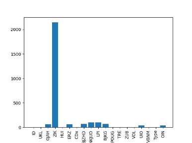
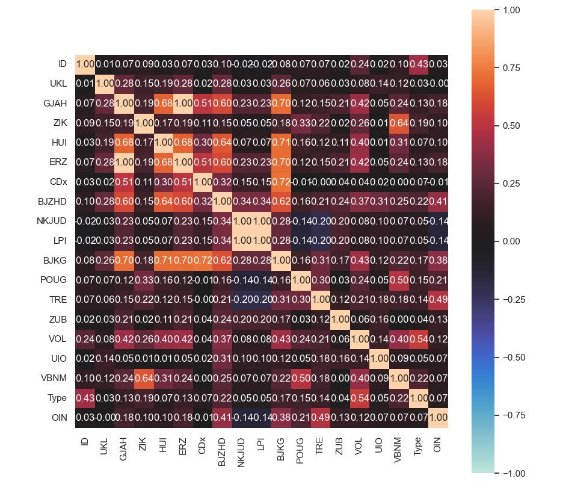
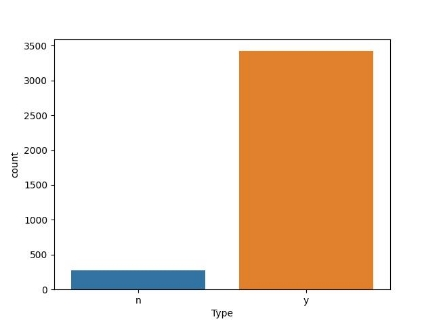

**Binary Classification of the given dataset using ML** 

**Objective:** The objective of the task is to use the given dataset to achieve binary classification. 

The first step of using any dataset to train a machine learning model to achieve classification is to analyze the data, clean the data and preprocess the data to get rid of any unnecessary information. To complete the task, Jupyter Notebook was used with the assistance of different modules as follows: 

- Pandas 
- Scikitlearn 
- Matplotlib 
- Seaborn 

**Methodology:** The working principle that was followed to successfully achieve the task is described in[` `**Figure 1**.](#_page0_x51.00_y457.92) The working principle is divided into four processes. 

 

**Figure 1- Methodology followed to achieve binary classification.** 

1. **Data Cleaning:** The data is checked for any inconsistencies. While analyzing the given data, there were duplicate entries i.e., entire rows were repeating in the dataset. Moreover, the dataset was divided into two CSV files which needed to be merged using the common column ‘ID’. To clean the data, duplicate rows were removed and then the datasets were merged using the common column. Merging the two datasets resulted in 4070 rows and 19 columns. However, cleaning the data by removing the duplicates provided cleaner data with 3700 rows and 19 columns. 
1. **Data Analysis:** A quick analysis of the dataset suggested the presence of empty values in the dataset as shown in[` `***Figure 2***.](#_page1_x51.00_y303.92) The column ‘ZIK’ had the most empty values with a total of 2145 null values. Overall, there were 2683 empty values in the columns and a total of 2237 rows with more than one empty cell.  

**Figure 2 – Number of null values in each column.** 

Further  analysis  suggested  that  there  were  11  columns  with  categorical  values  and  8    columns with numerical values. The categorical values must be converted to numerical type because most of the ML models do not accept such values. Bar plots were plotted to look for the  correlation  of  different  attributes,  which  would  remove  any  unnecessary  feature. Correlation matrices were calculated as shown in[` `***Figure 3***,](#_page2_x109.00_y482.92) which helped eliminate highly correlated features and affected the classification in the same way. More visualizations were created  to  look  for  more  information  about  the  dataset. The  result  of  the  analysis  also suggested a clear imbalance in the dataset as the class ‘n’ was underrepresented and only a small number was present in the dataset. A solution to this is described in the machine learning classifier section. 

3. **Data Pre-processing:** Analysis of the data suggested the necessary processing of the data to use it for training a classifier. ‘ZIK’ was found to be mostly empty, hence it would be beneficial to drop the column completely. However, there are other empty features that either needed elimination or imputation of new values. Imputation of new values was considered because the elimination of other features would have resulted in a loss of information. The other pre- processing step necessary for using the dataset to train a classifier is to convert the categorical 

variables to numerical ones. To achieve that one hot encoding was used. To add the missing 

**Figure 3 – Correlation matrix for all the features of the given dataset.** 

values in the dataset, an in-built method provided by sci-kit learn was used. A knn impute method was used that finds the nearest neighbors of the missing values and fills the missing value with the most occurring value in the selected neighbors. 

An investigation of the correlation matrix suggested pairs of features that had a high correlation coefficient. The pairs of features are as follows: 

- ‘NKJUD’ and ‘LPI’ 
- ‘GJAH’ and ‘ERZ’ 

More  information  from  the  visualization  suggested  the  elimination  of  features  like  ‘HUI’, ‘POUG’,’CDx’, 'BJKG\_hh' and 'GJAH\_rrr'. ‘ID’ was eliminated as well because it wouldn’t have any effect on the classification problem. Another step in the processing of the data was the 

standardization of the data which was achieved using the Minmax scaler of sklearn module in Python. 

4. **Machine learning classifier:** After the completion of the previous steps, the data can be passed to train the machine learning classifier. To train the classifier, a variety of methods were used and compared to find the best method and model that would be suitable to classify the given dataset with good accuracy and recall. The three methods followed were: 
- Method 1: Selection of features after analyzing the dataset. 
- Method 2: Selection of features using in-built Python module methods. 
- Method 3: Dealing with the data imbalance. 
1. **Selection of features after analyzing the dataset:** The first method used the features mentioned previously in the data pre-processing section. The dataset was used to train different machine learning classifiers like the Support Vector Machine classifier, KNN classifier, Decision Tree classifier, and Random Forest classifier.** 
1. **Selection of features using in-built Python module methods:** This used an in-built SelectKBest method that calculates the chi-square scoring function to select k best features. To summarize, it removes the less important features for classification. After a trial and error of selecting different k values, the best k features resulted in a value between 15 and 17. The k best features were selected, and the four classifiers as discussed before were trained.** 
1. **Dealing with the data imbalance:** The data analysis suggested a clear imbalance in the dataset as shown in[` `***Figure 4***.](#_page4_x51.00_y368.92) Hence, it is necessary to solve this problem. The simplest method to evaluate such a classifier is to use proper evaluation metrics as the accuracy score alone would not be the right metric. It must be evaluated along with precision, recall, and f1  score. An  overall  good  score  of  all these  metrics  would describe the performance of the classifier as good. There are other methods such as under-sampling and over-sampling which can be used to deal with this problem. To solve the presented problem, an over-sampling method (SMOTE- Synthetic Minor Oversampling Technique) was used. It focuses on the feature space to generate new instances with the help of interpolation between the positive instances that lie together. Once the data distribution achieves uniformity, SelectKBest method is used to select the k best features and then the four classifiers were trained.** 

**Figure 4 – Class imbalance in the dataset.** 

Training the four classifiers for all the above-mentioned methods was then followed by an evaluation of the metrics (accuracy, precision, recall, and f1 score). The method and the classifier that achieved the best performance is suggested to be the classifier that would achieve the binary classification of the dataset. The evaluation metrics were compared for the different methods and classifiers and are shown in Table 1.  SVM turned out to be the worst performing classifier when precision and recall are also considered. Method 1 where the features were selected by analysing the data proved to provide good accuracy, however, its precision and recall score were not so great. The selection of features using method 2 proved useful  as  it  showed  a  small  growth  in  the  classifier’s  performance.  However,  the  best performance was achieved by the Random Forest classifier in method 3 where the classifier was trained by selecting the features using sci-kit learn module, and the data imbalance was solved using SMOTE method. The classifier achieved a very good performance with an accuracy and precision of 99%, a recall score of 93%, and an f1-score of 96%. Hence, comparing  all  the  evaluation  metrics,  the  Random  Forest  classifier  using  method  3  is suggested as the best binary classifier for the given dataset. 

**Table 1- Evaluation metrics for the different classifiers using different methods.** 

<table><tr><th colspan="1" valign="top"><b>Method</b> </th><th colspan="1" valign="top"><b>Classifier</b> </th><th colspan="1" valign="top"><b>Accuracy</b> </th><th colspan="1" valign="top"><b>Precision(avg)</b> </th><th colspan="1" valign="top"><b>Recall(avg)</b> </th><th colspan="1" valign="top"><b>F1score(avg)</b> </th></tr>
<tr><td colspan="1" rowspan="4" valign="top">Method 1 </td><td colspan="1" valign="top">SVM </td><td colspan="1" valign="top">0\.97 </td><td colspan="1" valign="top">0\.83 </td><td colspan="1" valign="top">0\.83 </td><td colspan="1" valign="top">0\.88 </td></tr>
<tr><td colspan="1" valign="top">KNN </td><td colspan="1" valign="top">0\.97 </td><td colspan="1" valign="top">0\.99 </td><td colspan="1" valign="top">0\.82 </td><td colspan="1" valign="top">0\.88 </td></tr>
<tr><td colspan="1" valign="top">DT </td><td colspan="1" valign="top">0\.983 </td><td colspan="1" valign="top">0\.99 </td><td colspan="1" valign="top">0\.89 </td><td colspan="1" valign="top">0\.93 </td></tr>
<tr><td colspan="1" valign="top">RF </td><td colspan="1" valign="top">0\.986 </td><td colspan="1" valign="top">0\.99 </td><td colspan="1" valign="top">0\.91 </td><td colspan="1" valign="top">0\.95 </td></tr>
<tr><td colspan="1" rowspan="4" valign="top">Method 2 (k=15) </td><td colspan="1" valign="top">SVM </td><td colspan="1" valign="top">0\.955 </td><td colspan="1" valign="top">0\.98 </td><td colspan="1" valign="top">0\.70 </td><td colspan="1" valign="top">0\.77 </td></tr>
<tr><td colspan="1" valign="top">KNN </td><td colspan="1" valign="top">0\.981 </td><td colspan="1" valign="top">0\.99 </td><td colspan="1" valign="top">0\.88 </td><td colspan="1" valign="top">0\.93 </td></tr>
<tr><td colspan="1" valign="top">DT </td><td colspan="1" valign="top">0\.984 </td><td colspan="1" valign="top">0\.99 </td><td colspan="1" valign="top">0\.90 </td><td colspan="1" valign="top">0\.94 </td></tr>
<tr><td colspan="1" valign="top">RF </td><td colspan="1" valign="top">0\.982 </td><td colspan="1" valign="top">0\.99 </td><td colspan="1" valign="top">0\.89 </td><td colspan="1" valign="top">0\.93 </td></tr>
<tr><td colspan="1" rowspan="4" valign="top">Method 3 (k=17) </td><td colspan="1" valign="top">SVM </td><td colspan="1" valign="top">0\.916 </td><td colspan="1" valign="top">0\.73 </td><td colspan="1" valign="top">0\.88 </td><td colspan="1" valign="top">0\.78 </td></tr>
<tr><td colspan="1" valign="top">KNN </td><td colspan="1" valign="top">0\.988 </td><td colspan="1" valign="top">0\.99 </td><td colspan="1" valign="top">0\.92 </td><td colspan="1" valign="top">0\.95 </td></tr>
<tr><td colspan="1" valign="top">DT </td><td colspan="1" valign="top">0\.989 </td><td colspan="1" valign="top">0\.99 </td><td colspan="1" valign="top">0\.93 </td><td colspan="1" valign="top">0\.96 </td></tr>
<tr><td colspan="1" valign="top">RF </td><td colspan="1" valign="top">0\.990 </td><td colspan="1" valign="top">0\.99 </td><td colspan="1" valign="top">0\.93 </td><td colspan="1" valign="top">0\.96 </td></tr>
</table>

**Note:** 

**Notebook1-** **Binary\_classification\_task.ipynb:** This notebook contains method 1 and method 2 described above. 

**Notebook 2- Binary\_classification\_data\_imbalance\_solution.ipynb:** This notebook contains method 3 for all the four classifiers. 
